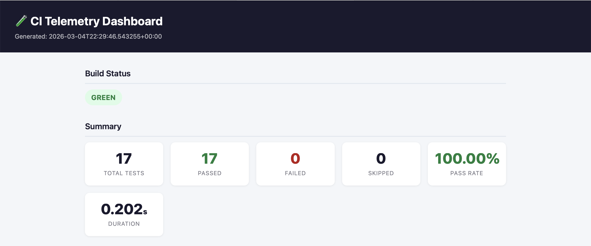
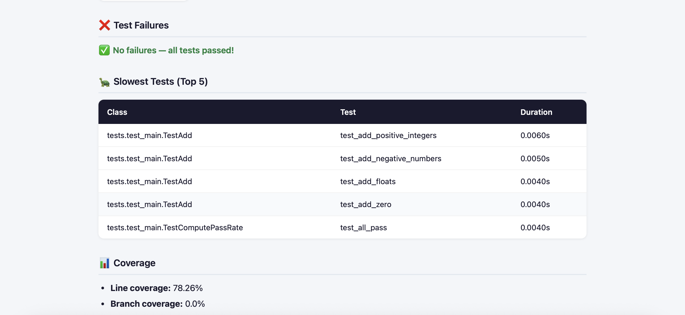

# 🧪 CI Telemetry Dashboard

> A portfolio project demonstrating CI/CD, Docker, Python automation, and reliability monitoring.

[](https://github.com/danwaseem/ci-telemetry-dashboard/actions/workflows/ci.yml)

## Dashboard Preview




## Quick Start (Local)
```bash
# 1. Clone
git clone https://github.com/YOUR_USERNAME/ci-telemetry-dashboard.git
cd ci-telemetry-dashboard

# 2. Set up virtual environment
python3 -m venv .venv && source .venv/bin/activate

# 3. Install dependencies
pip install -r requirements.txt

# 4. Run full pipeline
pytest tests/ --junitxml=report/junit.xml --cov=app --cov-report=xml:coverage.xml
python scripts/collect_telemetry.py
python scripts/generate_report.py

# 5. Open the dashboard
open report/output/index.html   # macOS
```

## Docker
```bash
docker build -t ci-telemetry .
docker run --rm ci-telemetry
```

## Project Structure
```
ci-telemetry-dashboard/
├── app/                    # Core Python logic
├── scripts/                # Automation scripts
│   ├── collect_telemetry.py
│   └── generate_report.py
├── tests/                  # pytest test suite
├── report/
│   ├── template/           # HTML template
│   └── output/             # Generated artifacts (git-ignored)
├── docs/                   # Design docs
├── .github/workflows/      # GitHub Actions pipelines
├── Dockerfile
├── requirements.txt
└── pyproject.toml
```

## See Also

- [docs/README.md](docs/README.md) — Full usage guide
- [docs/DESIGN.md](docs/DESIGN.md) — Architecture & future improvements
